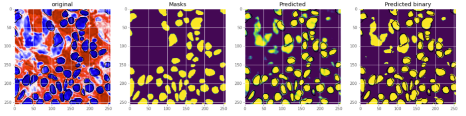
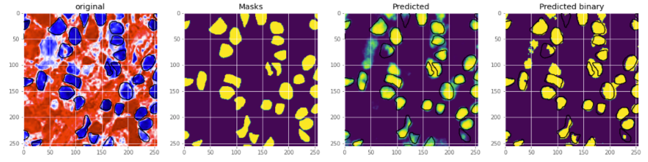
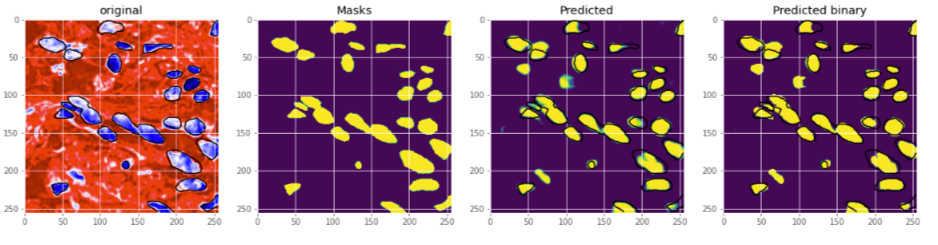

### Semantic Segmentation With Monuseg Dataset
Implementation of **SegNet**, **UNet,** and **DeepLabV3plus** for Semantic Segmentation of nuclei in digital histology images using Keras. [**Dataset**](https://monuseg.grand-challenge.org/Data/) contains multi organ tissue images with the ground truth segmentation masks for nucli. Dataset can also be downloaded from this Google Drive [link.](https://drive.google.com/open?id=1jeenIeQpt3F1jNeHDelFaVKrnwyk5ewP)
### Requirements
* Keras 2.x
* Python 3.x
* Tensorflow 1.x
### Folder Structure
├── __Code__     
│ &nbsp;&nbsp;&nbsp;&nbsp;&nbsp;&nbsp;&nbsp;&nbsp;└── UNET.ipynb  
│ &nbsp;&nbsp;&nbsp;&nbsp;&nbsp;&nbsp;&nbsp;&nbsp;└── Segnet.ipynb    
│ &nbsp;&nbsp;&nbsp;&nbsp;&nbsp;&nbsp;&nbsp;&nbsp;└── DeepLabv3plus.ipynb    
├── __Model__    
│ &nbsp;&nbsp;&nbsp;&nbsp;&nbsp;&nbsp;&nbsp;&nbsp;└── model-unet.h5  
│ &nbsp;&nbsp;&nbsp;&nbsp;&nbsp;&nbsp;&nbsp;&nbsp;└── model-Segnet.h5    
│ &nbsp;&nbsp;&nbsp;&nbsp;&nbsp;&nbsp;&nbsp;&nbsp;└── model-deeplabv3plus.h5  
### Quantitatvie Results
| Model | Loss | Accuracy | F1 Score | Dice Score |
| ----- | ---- | ---- | ---- | ---- |
| Unet | 0.106 | 0.956 | 0.894 | 0.922 
| Segnet | 0.229 | 0.903 | 0.767 | 0.825 
| DeeplabV3+ | 0.102 | 0.962 | 0.917 | 0.932  
#### Unet

#### Segnet

#### DeeplabV3+

Trained model has been found on this [link](https://drive.google.com/open?id=1FI45nZ8fudmkOO9InqkVpE7x6QVC1Rxh)
### Load Pretrained Model And Make Prediction
```
def display_masked(image, mask, image_name="image", mask_name="mask", cells_color=[1, 1, 0], figsize = (20, 20)):
    '''
    Show image with its segmentation mask
    '''
    # resize mask as a three channel image for ploting
    mask_resized = image.copy()
    mask_resized[:,:,0] = mask[:,:,0]
    mask_resized[:,:,1] = mask[:,:,0]
    mask_resized[:,:,2] = mask[:,:,0]

    # create a masked image
    mask_ = mask.copy().round().astype(int)
    masked_image = image.copy()
    masked_image[:,:,0][mask_[:,:,0]==1] = cells_color[0]
    masked_image[:,:,1][mask_[:,:,0]==1] = cells_color[1]
    masked_image[:,:,2][mask_[:,:,0]==1] = cells_color[2]

    plt.figure(figsize = figsize)
    plt.subplot(1,3,1)
    plt.imshow(image, 'gray')
    plt.title(image_name)
    plt.axis('off')
    plt.subplot(1,3,2)
    plt.imshow(mask_resized, 'gray')
    plt.title(mask_name)
    plt.axis('off')
    plt.subplot(1,3,3)
    plt.imshow(masked_image, 'gray')
    plt.title("{} with {} overlapped".format(image_name, mask_name))
    plt.axis('off')
    plt.show()
    return

import numpy as np
import cv2

model.load_weights("Model/[model-unet.h5/model-Segnet.h5/model-deeplabv3plus.h5]")
image_path = "[path to sample image]"

sample_image = cv2.cvtColor(cv2.imread(image_path), cv2.COLOR_BGR2RGB)
sample_image = cv2.resize(sample_image, SegNet_Configs.RESHAPE)
sample_image = np.array(sample_image, dtype="float") / 255.0
sample_image = np.expand_dims(sample_image, axis=0)

prediction = model.predict(sample_image)
prediction = prediction.round(0)

# display the sample image along with its predicted mask
display.display_masked(sample_image[0], prediction[0], "Tissue Image", "Predicted Mask")
```
