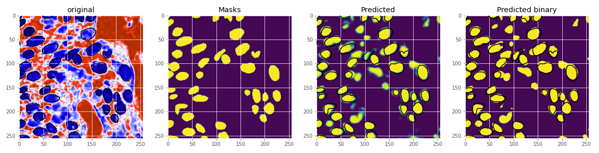
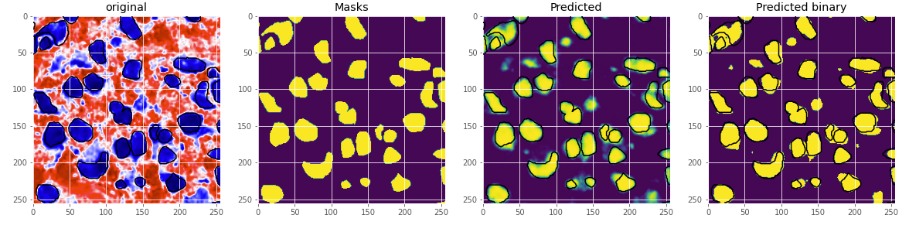

### Semantic Segmentation With Monuseg Dataset
Implementation of **SegNet**, **UNet,** and **DeepLabV3plus** for Semantic Segmentation of nuclei in digital histology images using Keras. [**Dataset**](https://monuseg.grand-challenge.org/Data/) contains multi organ tissue images with the ground truth segmentation masks for nucli. Dataset can also be downloaded from this Google Drive [link.](https://drive.google.com/open?id=1jeenIeQpt3F1jNeHDelFaVKrnwyk5ewP)
### Requirements
* Keras 2.x
* Python 3.x
* Tensorflow 1.x
### Folder Structure
├── __Code__     
│ &nbsp;&nbsp;&nbsp;&nbsp;&nbsp;&nbsp;&nbsp;&nbsp;└── UNET.ipynb  
│ &nbsp;&nbsp;&nbsp;&nbsp;&nbsp;&nbsp;&nbsp;&nbsp;└── Segnet.ipynb    
│ &nbsp;&nbsp;&nbsp;&nbsp;&nbsp;&nbsp;&nbsp;&nbsp;└── DeepLabv3plus.ipynb    
├── __Model__    
│ &nbsp;&nbsp;&nbsp;&nbsp;&nbsp;&nbsp;&nbsp;&nbsp;└── model-unet.h5  
│ &nbsp;&nbsp;&nbsp;&nbsp;&nbsp;&nbsp;&nbsp;&nbsp;└── model-Segnet.h5    
│ &nbsp;&nbsp;&nbsp;&nbsp;&nbsp;&nbsp;&nbsp;&nbsp;└── model-deeplabv3plus.h5  
### Quantitatvie Results
| Model | Loss | Accuracy | F1 Score | Dice Score |
| ----- | ---- | ---- | ---- | ---- |
| Unet | 0.253 | 0.878 | 0.635 | 0.730 
| Segnet | 0.386 | 0.703 | 0.403 | 0.462 
| DeeplabV3+ | 0.524 | 0.683 | 0.189 | 2.767
#### Unet

#### Segnet

#### DeeplabV3+

### Load Pretrained Model
